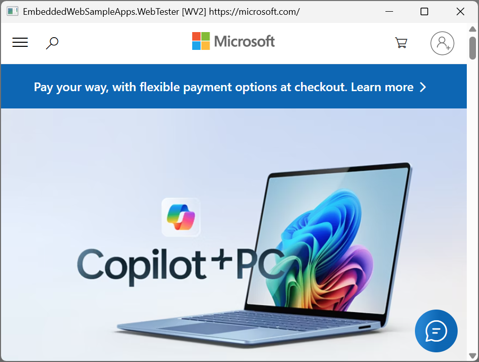
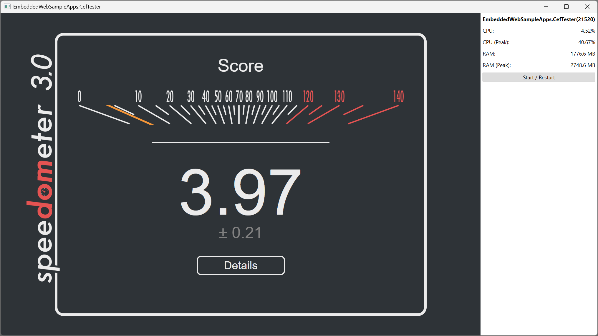
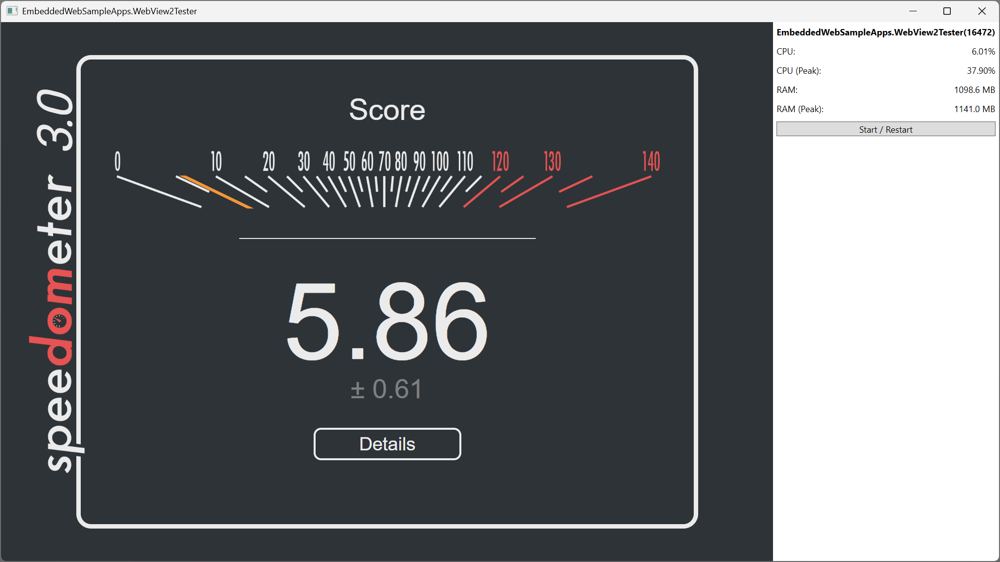

# Embedded Web Sample Apps

Sample apps to test the various ways web content is embedded in native desktop apps.

## WebTester



A .NET WPF app that can be called from the command line to load web content via either a [Microsoft Edge WebView2](https://developer.microsoft.com/en-us/microsoft-edge/webview2/) OR the [Chromium Embedded Framework](https://bitbucket.org/chromiumembedded/cef/src), to test their web apps, with a particular focus on gathering native performance metrics. It even even allows the caller to inject their own JavaScript (typically to drive the UI via the DOM).

### Setup
1. Make sure you have the [.NET 9 SDK](https://dotnet.microsoft.com/en-us/download/dotnet/9.0) installed.

### Build

Run the following script to build the self-contained tool:

```ps
scripts\build.ps1
```

It will be available in the `bld\` folder.

### Usage
1. `dotnet run -c Release --project src\EmbeddedWebSampleApps.WebTester`


See the help with `dotnet run -c Release --project src\EmbeddedWebSampleApps.WebTester -- -?`:

```
EmbeddedWebSampleApps.WebTester.exe [options]
Options:

--clear-cache         Clear the web browser cache before loading (default: False)
--log-file [file]     Log output to the given file (default: none)
--log-performance     Enable performance logging (default: False)
--log-web-console     Enable web console logging (default: False)
--post-load-js [file] Inject the given JS file after the Starting URI has loaded (default: none)
--starting-uri [uri]  Starting URI to load (default: https://microsoft.com/)
--web-host [WV2|CEF]  Control to host web content (default: WV2)
--window-size [WxH]   Window size (default: 640x480)
-?, --help            Display this help
```

### BrowserBench.org Test Suite
For an end-to-end example of using WebTester to automate running the full suite of [BrowserBench](https://browserbench.org/) benchmarks and aggregating results across multiple iterations, see the `scripts\run-browserbench-suite.ps1` script.

> **Note:** The script only works in [PowerShell 7](https://learn.microsoft.com/en-us/powershell/), not Windows PowerShell.


## CefTester



Simple .NET WPF app that loads [BrowserBench](https://browserbench.org/) via the [Chromium Embedded Framework](https://bitbucket.org/chromiumembedded/cef/src).

### Setup
1. Make sure you have the [.NET 9 SDK](https://dotnet.microsoft.com/en-us/download/dotnet/9.0) installed.

### Usage
1. `dotnet run -c Release --project src\EmbeddedWebSampleApps.CefTester`
2. Select a benchmark
3. Click "Start"

## WebView2 Tester



Simple .NET WPF app that loads [BrowserBench](https://browserbench.org/) via a [Microsoft Edge WebView2](https://developer.microsoft.com/en-us/microsoft-edge/webview2/).

### Setup
1. Make sure you have the [.NET 9 SDK](https://dotnet.microsoft.com/en-us/download/dotnet/9.0) installed.

### Usage
1. `dotnet run -c Release --project src\EmbeddedWebSampleApps.WebView2Tester`
2. Select a benchmark
3. Click "Start"

## History

This project was built by [Jon Thysell](mailto://jthysell@microsoft.com) as a part of Microsoft's March 2025 Fix/Hack/Learn event.
